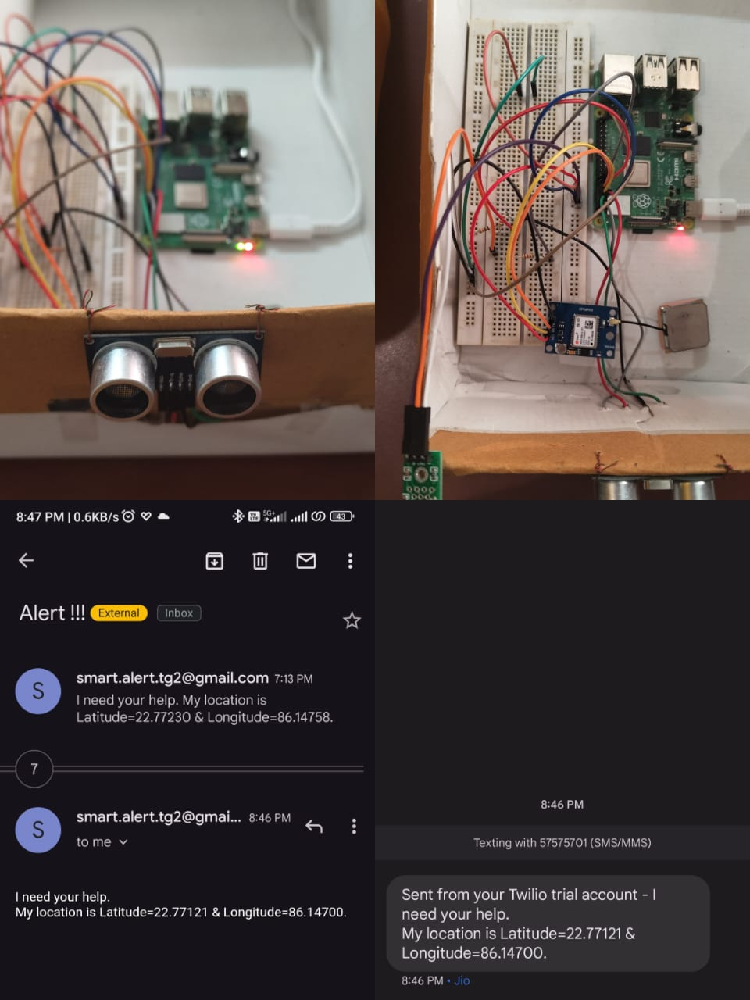

### SMART SHOE FOR BLIND & DEAF (IOT Project)

## Hardware Used :

- Raspberry Pi
- Ultrasonic Sensor
- Buzzer
- GPS module
- Pull Switch

## Software Used

- Python 3.9 as programming language
- VS Code as Code Editor

## How to run the code

To use the email feature, open google account settings and enable Two step authentication and genrate app password and replace the user and password variable in send_email.py

To use the text sms service go to Twilio website and create a free account and genrate AccounctSID, AccountToken and Phno and add this to Keys.py

Now to run the project, run main.py file.

